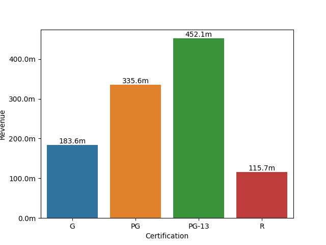
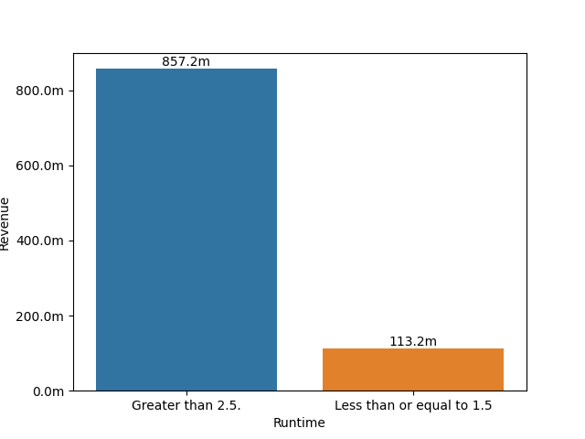

# Movies Analyzation

## Perform  ETL Technique  and Data Exploration on Multiple Dataset
**Guy Lozius**:

### Business problem:
Create a database on a subset of  IMDB's publicly available dataset and then use the database to analyze what makes a movie successful.     
### Data:
 
Basics, Rating, Akas Dataset source: (https://datasets.imdbws.com/)
TMDB Dataset source: (https://www.themoviedb.org/)
Dataset Description: 
- The Basics Dataset contains the name, release year, runtime, and  genres of the movies. 
- The Rating Dataset contains the number of votes the movie has received and weighted average of all the individual user ratings.  
- The Akas Dataset contains All the region the movies were released and the language of the region.  
- TMDB Dataset contains release date, revenue, budget,and runtime of the movie. 
### Methods:
- Extract data
- Clean/Transform data 
- Load Data to database
- Simply exploratory  
- Visual exploratory 
- Find if there is a Significant difference between groups

## Results
### Trends 
 
ON average PG-13 tend to have the highest revenue, while R movies tend to have the lowest revenue.

 
On average, movies that are over 2.5 hours long make more than more than 1.5 or less. 

## Recommendation.
Based on the data, movies that are rated PG-13 and movies with runtime of over 2.5 hours tend to have significantly higher revenue than others, so I recommend that more movies that are rated PG-13 and with runtime of over 2.5 hours to maximize revenue.
## Conclusion
In Conclusion, The goal is to create a database on a subset of  IMDB's publicly available dataset and then use the database to analyze what makes a movie successful. After applying some hypothesis testing techniques.There is a significant difference in revenue  between MPAA rating of a movie (G/PG/PG-13/R) and on average PG-13 movies tend to have the highest revenue. Moreover there is a significant difference in revenue between movies that are over 2.5 hours long and movies that are 1.5 hours long (or less) and on average movies over 2.5 hours tend to have higher revenue than movies that are 1.5 hours long (or less). I recommend that more movies that are rated PG-13 and with runtime of over 2.5 hours to maximize revenue.
